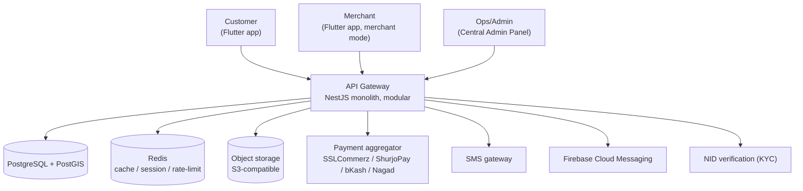
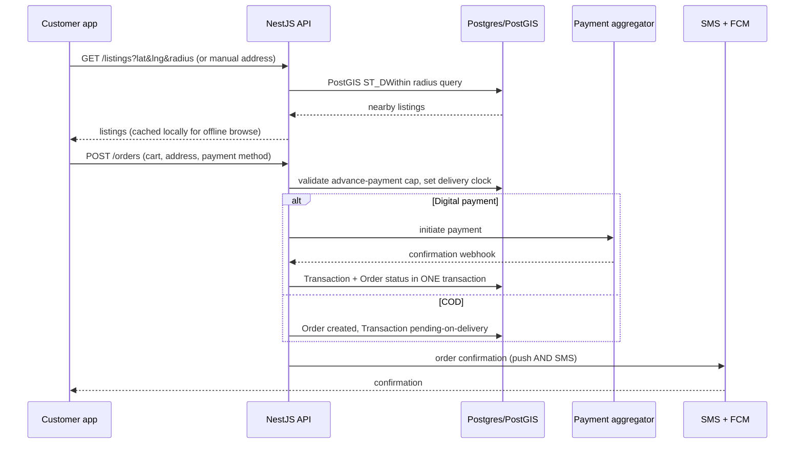

# Architecture Overview

**Scope: Phase 1 (MVP).** Customer mode + Merchant mode, hyperlocal e-commerce + service booking, bKash/Nagad + COD, single-city (Dhaka). Later-phase components appear here only as named seams, flag-gated and unimplemented.

## 1. System context

**Deployment shape for Phase 1: a modular monolith, not microservices.** Scale target is tens of thousands of DAU in one city (master prompt §8) — splitting services now buys distributed-systems cost with no present value. The NestJS module boundaries are drawn so that a later extraction (dispatch, payments) is a move, not a rewrite. See [ADR-0002](../adr/0002-modular-monolith.md).

## 2. Layers

| Layer | Responsibility | Must not |
|---|---|---|
| **Flutter app** | Rendering, local cache, action queue, optimistic UI | Contain business rules that affect money, compliance, or order state |
| **API (NestJS)** | Authoritative business logic, compliance gating, transactional state changes | Trust any client-supplied price, status, or role claim |
| **PostgreSQL** | System of record; geo queries via PostGIS | Be bypassed by cache writes — Redis is derived state only |
| **Redis** | Cache, sessions, rate limits, short-lived locks | Hold anything that cannot be rebuilt from Postgres |
| **Object storage** | Listing media, KYC document blobs | Serve unprocessed originals to clients |

## 3. Core Phase 1 flow: discovery → order → fulfillment

Two rules make this flow non-generic, and both are load-bearing:

- **Advance-payment gating** happens server-side at order creation, driven by the listing's `ready_to_ship` flag and whether an approved escrow path is used — not by the client. Digital Commerce Operation Guidelines 2021; see the [compliance matrix](../compliance/compliance-matrix.md).
- **Delivery clock** is stamped at advance payment: 5 days same-city, 10 days different-city, and is buyer-visible. It is a column, not a report.

## 4. Discovery mechanics

GPS radius search (1–10 km, PostGIS `ST_DWithin` on `geography`) is primary. It is **always** paired with a manual address fallback down the BD administrative hierarchy, because GPS is unreliable in dense low-rise areas and useless for indoor merchants. A discovery screen that only works with a GPS fix is an incomplete implementation, not a degraded one.

Search itself is Postgres full-text for Phase 1. No Elasticsearch/Meilisearch until Phase 2+ demonstrably justifies the ops overhead ([ADR-0003](../adr/0003-postgres-fts-before-search-engine.md)).

## 5. Offline and failure behaviour

| Condition | Expected behaviour |
|---|---|
| No network, app opened | Last-viewed catalog and order state render from local cache |
| Network drops mid-checkout | Order action is queued locally and retried; never silently dropped |
| App killed by load-shedding restart | Queue and cart survive; resume on next launch |
| Push undelivered | SMS carries order confirmations, OTPs, critical status changes |

Offline is core UX for this market, not polish. Details in [non-functional requirements](../engineering/non-functional-requirements.md).

## 6. Seams reserved for later phases

These exist as module boundaries and feature flags only — no Phase 1 implementation:

- `dispatch` — Phase 2 rider assignment. `Order.rider_role_id` is nullable from day one so adding it is not a migration of live order data.
- `ledger` — Phase 2 Digital Khata. This is why `Transaction` is separate from `Order`.
- `booking-pro`, `health` — Phase 3. Extend `Listing`/`Order`; do not create parallel tables.
- `community` — Phase 4. Brings user-generated content, and with it Cyber Security Ordinance 2025 moderation obligations.

## 7. What is deliberately not here

Message queue, event bus, GraphQL, microservices, custom stored-value wallet, multi-currency. Each has been considered and deferred; a custom wallet additionally carries Bangladesh Bank licensing exposure (master prompt §9). Proposing any of them requires an ADR stating the deviation explicitly.
