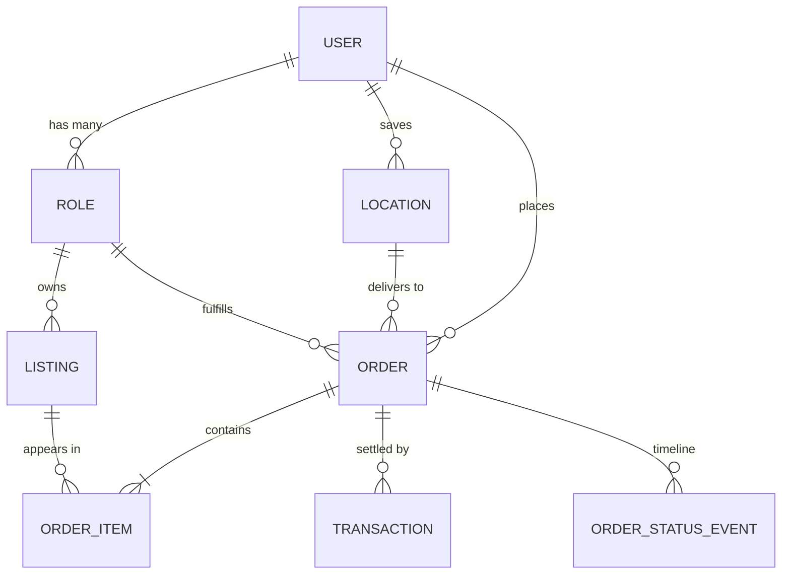

# Canonical Data Model

**Scope: Phase 1.** These six entities are defined once, here. Every feature-specific schema references them; nothing duplicates them. Master prompt §7.

## Entity relationships



## User

One identity per human. Never duplicated per role.

| Field | Notes |
|---|---|
| `id` | UUID |
| `phone_e164` | Primary identifier in BD context — phone, not email |
| `nid_number` | Set on KYC submission (migration 002); one NID per human, regardless of how many Roles they hold |
| `nid_verification_status` | `unverified` / `pending` / `verified` / `rejected` |
| `language_preference` | `bn` default, `en` secondary — see [i18n conventions](../localization/i18n-conventions.md) |
| `default_location_id` | FK → Location |

Roles are *assignments on this identity*. A merchant who also buys is one User with two Roles, not two accounts. Role switching is a UI affordance over this.

## Role

Role-specific profile data hangs here, keeping User thin.

| Role type | Phase | Role-specific payload |
|---|---|---|
| `customer` | 1 | (minimal) |
| `merchant` | 1 | business name, trade licence ref, NID KYC ref, pickup Location |
| `rider` | 2 | vehicle type, BRTA licence ref, registration ref |
| `professional` | 3 | credential/licence refs |

Phase 2+ role types exist in the enum but are flag-gated at the API. Reserving the enum value now avoids a breaking migration later.

`kyc_submission` (migration 002) is a Role's append-only KYC submission history -- reference URLs into object storage, never document content (compliance matrix row K1). A resubmission after rejection adds a row rather than overwriting one, same audit reasoning as `order_status_event`.

## Listing

A sellable or bookable unit: product, service slot, or (Phase 3) rental asset. Owned by a Role, geo-tagged, priced in BDT.

The compliance-critical field:

- **`ready_to_ship`** (boolean) — whether the item is deliverable within 72 hours. This drives the advance-payment cap. It is per-listing, set by the merchant, and auditable. Without it the 10%/100% rule cannot be enforced; see the [compliance matrix](../compliance/compliance-matrix.md).

Also carries `listing_type` (`product` | `service_slot`), `category_id` (used for prohibited-category enforcement), and a `geography` point for PostGIS radius search.

## Order

Links Customer, Listing(s), Merchant, optional Rider, payment method, status timeline, and delivery timeline.

Compliance-critical fields:

| Field | Why it exists |
|---|---|
| `advance_amount_bdt` | Must respect the 10% cap unless `ready_to_ship` or escrow — validated server-side |
| `advance_paid_at` | Starts the delivery clock |
| `delivery_deadline_at` | `advance_paid_at` + 5 days same-city / 10 days different-city. Buyer-visible. |
| `is_same_city` | Derived at order creation from merchant and delivery Location |
| `rider_role_id` | Nullable, Phase 2. Present now so dispatch is additive. |

Status changes are recorded as `ORDER_STATUS_EVENT` rows, not by overwriting a single column — the timeline is evidence, and business data must be retained and producible on request.

## Transaction

Payment record: method (`bkash` | `nagad` | `cod` | `escrow`), amount, settlement status, aggregator reference.

**Kept deliberately separate from Order** so that Phase 2's Digital Khata (merchant ledger) can reference transactions independently, and so COD-to-digital reconciliation has somewhere to live. One Order may have several Transactions (advance + balance on delivery).

Order status and Transaction status changes must be **transactional** — a payment confirmation and an order-status update can never desync. This is a database transaction requirement, not an application-layer best-effort.

## Location

Reusable structured address following BD's actual administrative hierarchy:

```
Division → District (Zila) → Upazila/Thana → Union/Ward → Village/Mohalla → address line
```

Plus an optional `geography(Point, 4326)` for GPS. The hierarchy is not decoration — it is the manual fallback path when GPS fails, and it is how "same city" is determined for the delivery clock. A generic city/state/zip model cannot express BD addresses and must not be substituted.

## Extending this model

Phase 2+ features **extend** these entities. They do not create `Booking2`, `Job`, or `DeliveryOrder` tables that duplicate Order's shape. Rules and worked examples: [extension rules](extension-rules.md). Concrete DDL: [`phase-1-schema.sql`](phase-1-schema.sql).
